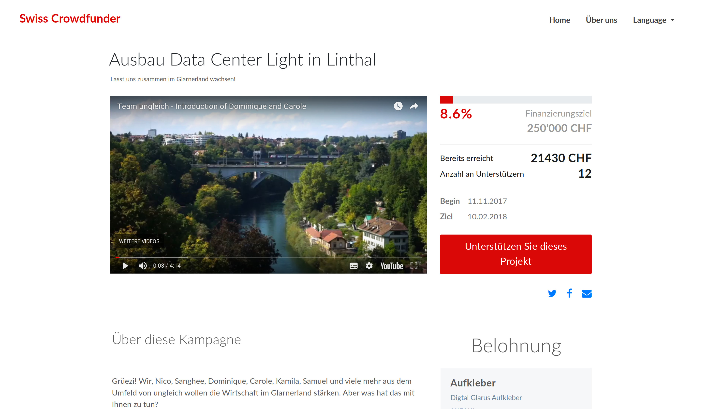
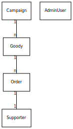

README
======

Tests (CircleCI): 

Security (Hakiri): 

Maintainability (Codeclimate): 

The core maintainers organize their to-dos in org-mode here:
[TODO.org](TODO.org)

What does this project do?
--------------------------

Swiss Crowdfunder is a Crowdfunding platform (doh).

This repository is the open source community version of
<https://swiss-crowdfunder.com>.

### Screenshot of a campaign

Why is this project useful?
---------------------------

Crowdfunding using established platforms can be very expensive. Usually
there is a fee of 12-20% that has to be paid.

Swiss Crowdfunder is open source - so it can be used by anyone to start
their own crowdfunding platform or campaign.

How do I get started?
---------------------

### Setup

1.  Install RBenv

    macOS: `brew install rbenv`

    Official rbenv documentation: <https://github.com/rbenv/rbenv>.

2.  Install Ruby version 2.4.1

    macOS: `rbenv install 2.4.1`

3.  Install bundler

    `gem install bundler`

4.  Clone the repository

5.  Install dependencies

    Within your local checkout run `bundle`.

    For testing, install `chromedriver` &gt; v59.

6.  Configure Database

    Every host that runs this application can have a different database
    configuration. There is an example configuration that runs on
    sqlite, however that you can easily use by:

    `cd config; ln -s database.yml.example database.yml; cd -`

    Alternatively you can configure PostgreSQL, MySQL or others.

7.  Migrate Database

    `rake db:create db:migrate db:seed`

### Development

1.  Start Application

    `rails s`

2.  Run tests

    Automatically run tests while development

    `guard`

    Note for Emacs Users: When using `enh-ruby-mode`, this will also
    automatically color your status bar either green on success or red
    on error.

3.  Live Reload

    Using the Gems `guard-livereload` and `rack-livereload`, development
    and saving of `*.erb` files will reload your browser. Developing
    `*.scss` files will also hot-load the respective CSS within the
    browser.

### Configuration

When cloning/forking your own version of Swiss Crowdfunder, there are
some places where you can add your own configuration:

1.  Deployment

    Configuration is done through the [config
    gem](https://github.com/railsconfig/config).

    -   [ ] Copy the example configuration:

        `cp config/settings.local.yml.example config/settings.local.yml`

    -   [ ] Configure the corresponding settings files for your
        different stages and hosts in the `config/settings` folder

    -   `config/deploy.rb`

        -   [ ] If you're using a fork of Swiss Crowdfunder, configure
            your `:repo_url`

        -   [ ] Configure where to get your `config/secrets.yml` file

        -   [ ] Configure Mattermost push notifications

            -   [ ] If you want to use Mattermost push notifications,
                enable/disable them in `config/settings.yml`

            -   [ ] If you use Mattermost, configure the webhook
                endpoint that should receive the messages in the
                `config/settings.yml`

    -   `config/deploy/*rb`

2.  `config/secrets.yml`

    -   [ ] Either configure your own `config/secrets.yml` or set the
        `SECRET_KEY_BASE` environment variable in production

    -   [ ] Configure your own servers for deployment

### Deployment {#deployment-1}

1.  Deploy

    We are using `capistrano` to deploy the newest version, roll back,
    compile assets and restart the app container.

    Deploy the newest version of `master`: `cap production deploy`

    Optionally you can locally set a local ENV variable `REVISION` to
    set a different branch than `master` for deployment.

Where can I get more help, if I need it?
----------------------------------------

We have a public Mattermost chat channel for the Swiss Crowdfunder:
<https://brandnewchat.ungleich.ch/ungleich/channels/swiss-crowdfunder>

Otherwise, please open a Github issue or get back to us via email
(info@200ok.ch or info@ungleich.ch).

Technical Documentation
-----------------------

### ERD

There is an [ERD](doc/erd.dot) defined in dot-syntax which is also
available as .

The command to compile the SVG is: `dot -Tsvg doc/erd.dot > doc/erd.svg`

### Security

For the initial version of the application, there is only one route that
can create entities, none that can update or destroy any. Creation of
the resource only works on a valid model and has only the potential side
effect of generating more money for the campaign. Apart from a brute
force attempt of creating bogus data, there's little security risk
involved.

Also, there's no concept of a logged-in user, yet. Therefore, there is
no global lock-down needed/possible. The `cancancan` and `device` gems
are in place, though, for authorization and authentication as soon as
supporters get the ability to create/modify/destroy any other data or
have the ability to log in.

### Testing on CI

We are using
[CircleCI](https://circleci.com/gh/200ok-ungleich/swiss-crowdfunder).
